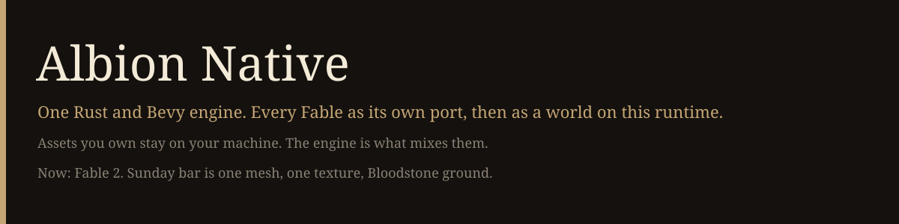

<p align="center">
  
</p>

<p align="center">
  <a href="https://www.rust-lang.org"></a>
  
  
</p>

Albion Native is the engine. Fable, The Lost Chapters, Anniversary, Fable 2, Fable 3, and Legends are each a standalone Rust and Bevy port, then a world on this runtime. One loader. User meshes, names, companions, and mounts drop in beside the originals. The disc stays on the machine that owns it.

Fable 2 is the only port with code. The rest are named so the layout does not get reinvented. Studio head: [jxnplays](https://github.com/jxnplays).

## Paste this

```text
You are on Albion Native. Read https://github.com/jxnplays/albion-native in this order: README.md, docs/SHARE.md, docs/ISSUES.md, docs/OPERATOR.md, docs/HARDWARE.md, SECURITY.md, docs/PUBLISH.md.

The end state is one engine and a port of each Fable. The job today is not that. The code is jxnplays/fable2rustybev if you were given access. Do not open any other repo. Do not search the disk for a dump. If FABLE2_DUMP is unset, stop and write BLOCKED.

Build as is: cargo test --workspace, then cargo run -p fable2_game. Stay under 90% of this PC's RAM and VRAM.

Your job is I-01 through I-04: mount the dump, put one converted mesh in the window, put one texture on it, draw Bloodstone ground, and save a shot. Do not start combat, a quest, a custom mesh, or a second engine.

A different model reviews the diff. If the shot is real and no game file is in it, publish in this same session. Studio session: push. Anyone else: open a pull request. Do not sit on a working fix. Do not push to jxnplays unless this session belongs to the studio head.
```

## End state

| World | Role | Now |
|---|---|---|
| Fable 2 GOTY | First port. Builds the engine. | Code exists. Street does not. |
| Fable 3 | Second port, then a pack. | Opens when Fable 2 is 1:1. |
| Fable, TLC, Anniversary | Earlier games. Anniversary is presentation on TLC. | Not opened. |
| Fable Legends | Last. Legal source only. | Not opened. |
| User meshes | Companions, mounts, mobs, props. | Contract only. `docs/MODS.md` |

## Sunday

| Need | State |
|---|---|
| One converted mesh in the window | `░░░░░░░░░░` |
| One original texture on it | `░░░░░░░░░░` |
| Bloodstone ground under the body | `░░░░░░░░░░` |
| A shot of those three | `░░░░░░░░░░` |

## Board

| Chunk | Bar |
|---|---|
| Window opens | `██████░░░░` 60% |
| Models convert | `███████░░░` 70% |
| Textures convert | `██░░░░░░░░` 20% |
| Bloodstone parsed, not drawn | `███░░░░░░░` 35% |
| Clips decoded, not playing | `████░░░░░░` 40% |
| Dump hooked up | `█░░░░░░░░░` 10% |
| NPC names and user meshes | `░░░░░░░░░░` 0% |
| Fable 2 1:1 | `█░░░░░░░░░` 6% |
| Second world on the engine | `░░░░░░░░░░` 0% |

Rules: [docs/BOARD.md](docs/BOARD.md), [docs/LINEUP.md](docs/LINEUP.md), [docs/PUBLISH.md](docs/PUBLISH.md).
